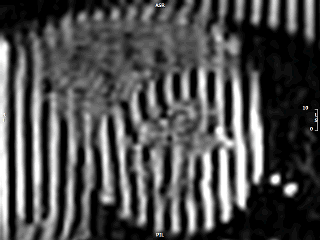
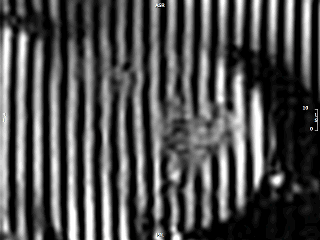
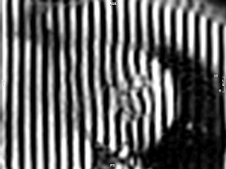

# Highly-Accelerated Real-Time Myocardial Tagging for Exercise CMR at 3T

The figure below shows 30-year-old male whose heart rate (HR) increased from 72 bpm to 149 bpm with 25W protocol. Pre- (first row) and post-exercise (second row) images are shown at basal, mid and apical levels (columns 1-3). Post-exercise showed a considerable increased in left ventricular deformation, particularly in the apex

 

  
  
  

  
  
  

 

